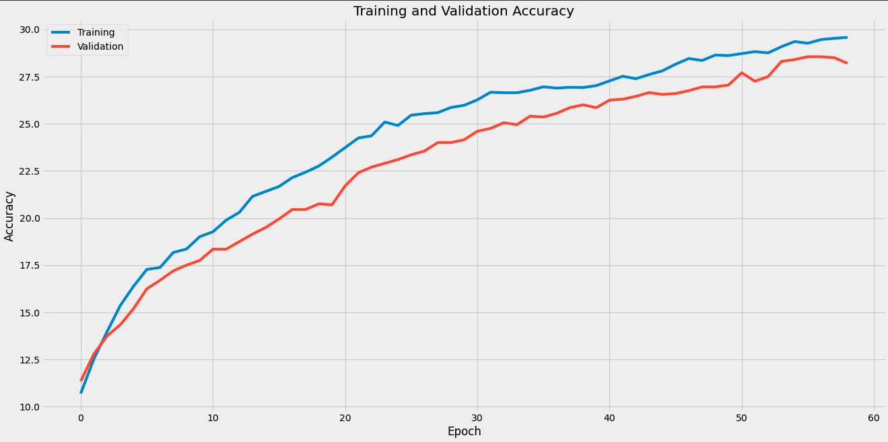
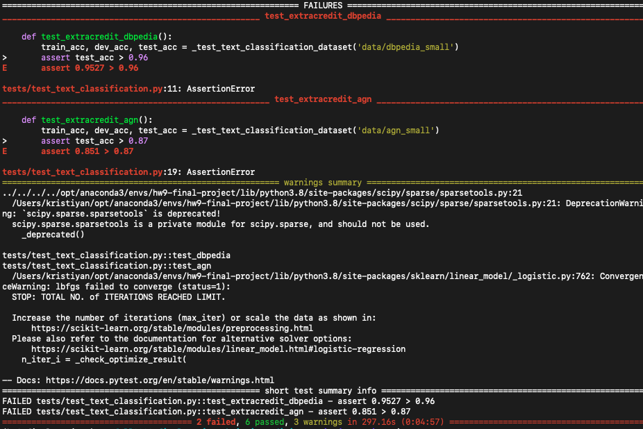

# Coding (7 points)

This assignment is a combination of two assignments.  The first part is convolutional neural networks, which builds on your neural network homework.  The second part is a small project in which you will use the knowledge you gained over the course of this quarter to build a machine learning system that classifies snippets of text into categories.

The convolutional neural net task involves implementing the models in `src/models.py`.  The text classification task involves implementing the text classification class in `src/text_classificaion.py`, which involves two main parts:

- Converting raw text into feature vectors that can be processed by your machine learning algorithm.  We've been giving you ready-to-use feature matrices up until this point in the quarter, but deciding how to make features from raw data is an important part of machine learning in practice, so that's what you'll be doing here.
- Choosing a machine learning model to learn from the features

Read the comments in the `train` method of the TextClassificationModel class for requirements and hints.  You aren't required to use any particular algorithm; the goal is to have you explore various featurization and machine learning methods to find a combination that acheives the desired accuracy, which is how ML commonly works in the real world.

**IMPORTANT:** There are two extra credit tests in the autograder, called "test_extracredit_dbpedia" and "test_extracredit_agn".  You don't need to pass those to get a 100/100 score.  If you pass all tests including those ones, you'll get 110/100, which is about 0.7 total points of extra credit.

**ALSO IMPORTANT:** Given the large number of students in the course, your code will be limited by default to a total of 30 minutes of runtime on our server when we run the autograder.  If you opt to use a computationally expensive model to get the highest possible accuracy please let us know so we can ensure you get enough runtime.

You should make a conda environment for this homework just like you did for previous homeworks. We have included a requirements.txt.

# Free-response questions (3 points)

To answer the free-response questions, you will have to write extra code (that is not covered by the test cases). You may include your experiments in new files in the `experiments` directory. See `experiments/example.py` for an example. You can run any experiments you create within this directory with `python -m experiments.<experiment_name>`. For example, `python -m experiments.example` runs the example experiment. You must hand in whatever code you write for experiments by pushing to github (as you did for all previous assignments). 

**NOTE: if we have any doubts about your experiments we reserve the right to check this code to see if your results could have been generated using this code. If we don't believe it, or if there is no code at all, then you may receive a 0 for any free-response answer that would have depended on running code.**

## Convolutional layers (1 point)

Convolutional layers are layers that sweep over and subsample their input in order to represent complex structures in the input layers. For more information about how they work, [see this blog post](https://ujjwalkarn.me/2016/08/11/intuitive-explanation-convnets/). Don't forget to read the PyTorch documentation about Convolutional Layers (linked above).

10. (0.25 points) Convolutional layers produce outputs that are of different size than their input by representing more than one input pixel with each node. If a 2D convolutional layer has `3` channels, batch size `16`, input size `(32, 32, 1)`, padding `(4, 8)`, dilation `(1, 1)`, kernel size `(8, 4)`, and stride `(2, 2)`, what is the output size of the layer (1 input layer, 3 output layers)?

If you're unsure about the answer, explain why you came up with the specific output size and we can give you points for your derivation, even it's wrong.

   - To answer this question I used the below formula from the [PyTorch documentation on Conv2D](https://pytorch.org/docs/stable/generated/torch.nn.Conv2d.html?highlight=conv#torch.nn.Conv2d)
   
   
   
  Substituting in the values given I get that Hout = 17 and Wout = 23.
  
  Since we have a batch of 16 and 3 output channels, the final Size of the output will be (N, Cout , Hout , Wout) =(16, 3, 17, 23)

11. (0.25 point) Combining convolutional layers with fully connected layers can provide a boon in scenarios involving learning from images. Using a similar architecture to the one used in hw7 (neural networks) question 8, replace each of your first two hidden layers with a convolutional layer, and add a fully connected layer to output predictions as before. The number of filters (out_channels) should be 16 for the first convolutional layer and 32 for the second convolutional layer. When you call the PyTorch convolutional layer function, leave all of the arguments to their default settings except for kernel size and stride. Determine reasonable values of kernel size and stride for each layer and report what you chose. Tell us how many connections (weights) this network has.

   - I ended up using kernel sizes (3,3) for both convolutional layers. It makes sense to use a square kernel, because the images are square and there isn't any reason to treat the two dimensions (width and height) differently. Perhaps it would make sense to use a smaller kernel for the second layer, because the images naturally shring as they go through subsequent convolutional and maxpool layers.
   - I used stride = (1,1) for all alyers; I didn't see any reason to use a larger stride (perhaps that would make more sense if our images were much higher resolution than 64x64.
   
   In terms of number of weights:
   - The first convolutional layer has 16 output channels i.e. 16 different kernels, each with 3x3=9 weights. Therefore, the total number of weights here is 16x9=144. We multiply this by 3, because we have 3 input channels. => 144x3 = 432.
   - There aren't any weights for the maxpool layers
   - The second conv. layer has 32 output channels, with kernel size 3x3=9 each, which makes 32x9 = 288. We multiply this by 16, because that's the number of input channels we have => 288x16 = 4,608
   - For the final fully connected layer, we need to calculate based on the formula mentioned earlier. When the dilation, padding, and stride are the default parameters, the formula for dimensions of the output boils down to `np.floor((I-K)/S + 1)` for both Conv2D and MaxPool2D, where I is the input, K is the kernel size and S is the stride.
   - Applying the formula for Input > Conv2D > MaxPool2D > Conv2D > MaxPool2D I get 64 > 62 > 31 > 29 > 14. So the final number of weights will be 14 * 14 * 32 * 10 = 62,720 (we multiply by 14 twice, once for height, once for width; we multiply by 32, because that's the number of channels we're flattening; we multiply by 10, because we have 10 output nodes).
   
   Therefore, the total number of parameters = 432 + 4,608 + 62,720 = 67,760.

12. (0.5 point) Train your convolutional model on DogSet. After every epoch, record four things: the loss of your model on the training set, the loss of your model on the validation set, and the accuracy of your model on both training and validation sets. (Use the same batch size, max epochs, learning rate)

   I did some experimentation here and found the following:
   - Training for 10 epochs, with a batch size of 10, on CPU, took ~140 seconds
   - Training for 10 epochs, with a batch size of 10, on GPU, toop ~35 seconds i.e. 4x _faster_!
   - In the model definition I had to change x.view to x.reshape, because otherwise something breaks when moving the tensors to GPU.
   - Larger batch size makes training _faster_ e.g. I increased batch size from 10 to 100, and 10 epochs took 11 seconds (instead of 35).
   - However, increasing the batch size too much (200, 500, 1000) actually caused me to hit my early stopping criteria within just a few epochs and consequently the performance of the model was garbage (~12% accuracy)
   - So, in the end I set batch_size = 20, n_epochs = 100, and increased the learning_rate from 1e-5 to 1e-4 (otherwise I would have had to train for many more epochs).

    * Report the number of epochs your model trained, before terminating.
      - My model stopped training after 59 epochs.
  
    * Make a graph that has both training and validation loss on the y-axis and epoch on the x-axis.
   
      
    * Make a graph that has both training and validation accuracy on the y-axis and epoch on the x-axis. 
   
   
    * Report the accuracy of your model on the testing set.
    
    - Accuracy on the test set was 26.3%, just a little lower than the validation accuracy, which is expected.

## Digging more deeply into convolutional networks (1 point) ##

The most important property of convolutional networks is their capability in capturing **shift invariant** patterns. You will investigate this property by training a convolutional network to classify simple synthesized images and visualizing the learned kernels. 

**Exploring the synthesized dataset:** Download the [synth_data file](https://nucs349.github.io/data/synth_data.zip), unzip it, and put it in `/data` directory. `synth_data` contains 10000 images of simple patterns, divided into 2 classes (5000 images per class). Use the `load_synth_data` function in `data/load_data.py` to load the training features (images) and labels. 

13. (0.5 point) Go through a few images and plot two examples (1 from each class). What is the common feature among the samples included in each class? What is different from one sample to the next in each class? What information must a classifier rely on to be able to tell these classes apart?

       
   
- All images are 28x28 with 1 channel; there are 10,000 images
- The first 5000 images (with class=0) have 3 horizontal white lines, the rest being mostly "black" noise
- The images in the first class differ only by the vertical position of the 3 horizontal lines
- The second 5000 images (with class=1) have 3 vertical white lines, the rest being mostly "black" noise
- The images in the second class differ only by the horizontal position of the 3 vertical lines.

I suppose that a classifier will need to rely on detecting a horizontal edge for the first class and a vertical edge for the second class.
This makes me wonder why we need 3 different convolutional layers in the model.

**Build the classifier:** Create a convolutional neural network including three convolutional layers and a linear output layer. The numbers and sizes of filters should be as follows:

* First layer: 2 filters of size (5,5)

* Second layer: 4 filters of size (3,3)

* Third layer: 8 filters of size (3,3)

Use strides of size (1,1) and ReLU activation functions in all convolutional layers. Each convolutional layer should be followed by max-pooling with a kernel size of 2. Use an output linear layer with two nodes, one for each class (note that for binary classification you can use a single node with a sigmoid activation function and binary cross entropy loss, but using softmax and cross entropy keeps the code simpler in this homework).

**Training parameters:** Use a cross entropy loss and the SGD optimizer. Set the batch size to 50 and learning rate to 1e-4. Train the network for 50 epochs.   

14. (0.5 point) Once the network is trained extract and plot the weights of the two kernels in the first layer. Do these kernels present any particular patterns? If so, what are those patterns and how are they related to the classification task at hand and the classifier performance? Note that since the model is randomly initialized (by default in PyTorch), the shape of kernels might be different across different training sessions. Repeat the experiment a few times and give a brief description of your observations.

I trained the network 3 times and here are the plots for the 2 kernels:
- First Iteration
      
- Second Iteration
      
- Thrid Iteration
      
   
Honestly, this isn't exactly what I was expecting. I thought I would see more of a vertical, horizontal, or diagonal split between light and dark regions.
Right now, I don't really see any pattern, but perhaps I would have to plot what things look like after subsequent layers. Also, perhaps I shouldn't expect to see a clear pattern in a single kernel's image; rather, looking at both images in combination they might be representing the expected patterns.

Finally, it's worth noting that there are often "bright" pixels next to "dark" pixels, which to me speaks to some kind of "border" or "edge" detection.

## Text Classification (1 point)

Write up a short description of the thought process and steps you took to complete the text classification coding part of the assignment.  Mention any methods (featurization+models) you tried that didn't give the desired results as well as a short description (sentence or two at least, but longer if you want to give details) of the method you arrived at in the end.  Write down the final accuracy you got on the test set for each of the two tasks (dbpedia and agn) just in case we aren't able to reproduce your results.

For data preprocessing I:
- Used gensim.utils.simple_preprocess, which tokenizes, converts to lowercase, removes punctuation, and removes any tokens with length less than 3 and more than 15.
- Removed any tokens found in the 'english' corpus of nltk.stopwords

For feature generation & modelling I did 3 things:
- Bag of Words or TF-IDF with fully connected Neural Network. Max AGN accuracy 84.08%
- Pretrained word embeddings (GloVe) with fully connected Neural Network. Max AGN accuracy of 87.86% and max DBPedia accuracy of 73.44% (with the same network)
- Same pretrained word embeddings with a simple Logistic Regression. This achieved an 85.1% on the test AGN data and 95.27% on the DBPedia test data. This is the setup I am submitting in my code; I have commented out all old attempts.

Note: I don't think I need GPU for recreating my work; My highest results (and the ones I'm submitting) take ~5 minutes to run on my laptop (no GPU) and the most time consuming part is downloading the pretrained word embeddings, which are ~376MB.

Also important Note: I commented out the `assert 'sklearn.feature_extraction' not in sys.modules.keys()` line in test_a_environemnt.oy per Mike D'Acry's recommendation in [Campuswire post #2557](https://campuswire.com/c/G63AA7CEA/feed/2557). This is because nltk internally imports sklearn.feature_extraction, which causes this test to fail.

### Bag Of Words & TF IDF with NN

- I implemented Bag Of Words and TFIDF and tried to fit a fully connected Neural Network with different parameters, number of layers and number of nodes. This approach got me to ~84% Accuracy for the AGN data. Here, it is important to mention some details in how I implemented Bag Of Words & TF-IDF. 

- Similar to the sklearn implementations (CountVectorizer & TfIdfVectorizer) I added a min_fq parameter to remove any words in the vocabulary which appear less than X number of times across all documents. The two values I tried in my tests were 10 and 20. This had the great effect of reducing my vocabulary size (i.e. number of features) from 17,186 to 2,594 (for min_fq=10) and 1,264 (for min_fq=20) respectively. This is crucial since our training data is just 5,000 documents.

Here are a few charts of my training & validation loss & accuracy for different parameters:

Bag Of Words with network of 256>128>64

TF_IDF with network of 256>128>64

128_64.png'/>
128_64.png'/>

### Pretrained Embeddings with NN

- I then moved to pretrained word embeddings. I tried several different ones from the [gensim library](https://github.com/RaRe-Technologies/gensim-data): `'fasttext-wiki-news-subwords-300'`, `'glove-wiki-gigaword-50'`, `'glove-wiki-gigaword-300'`, `'word2vec-google-news-300'`. The one that gave the best results was `glove-wiki-gigaword-300`.

- I'm particularly happy with the method I discovered in [this StackExchange post](https://stats.stackexchange.com/questions/221715/apply-word-embeddings-to-entire-document-to-get-a-feature-vector) for converting an entire document's word embeddings to a single document embedding. In essence, I compute the GloVe word embedding for each token in a document, then concatenate the coordinate-wise mean, min, and max of all tokens in the document. Since I'm using the GloVe-300 embedding, my final feature vector has length 900.

- And again, I spent a lot of time trying many different parameters for a fully connected NN. The highest accuracy I achieved on the AGN data is 87.86% on the test data. This was with a Network having the following number of nodes from input to output: 900 > 256 > 128 > 64 > 32 > 4. I used a batch size of 1, learning rate 1e-4 * 5, and trained for 50 epochs. This, unfortunately, did not generalize well for the DBPedia data where I achieved only ~73% accuracy.

Accuracy curves on training & validation for AGN data:

Accuracy & Loss on training & validation for DBPedia data:

### Pretrained Embeddings with Logistic Regression

Since I couldn't get the Neural Network to generalize well for both datasets, I decided to try a simple Logistic Regression. I probably should have done that in the first place and saved myself a lot of pain, but I still appreciate I got to play around with Neural Networks and tune them. Logistic Regression with my GloVe embeddings ran quite fast (~5 minuts vs. ~1 hour for the Neural Network approach) and managed to achieve 85.1% and 95.27% on the AGN & DBPedia datasets respectively. I also tried Random Forests and Gradient Boosted Trees, but they both gave slightly lower accuracy on the test set.

Here is a screenshot of my terminal after running the tests

My notebooks are messy, because of the many experiments I ran, but you can see my work in ` Experiments.ipynb`, `colab_experiments.ipynb`, `colab_experiments_2.ipynb`, `colab_experiments_3.ipynb`.

Also let us know how long you spent working on this part of the assignment and any feedback you have for it (this will help us judge the difficulty for future courses).

- I probably spent ~20 hours on this part of this assignment :O
- I had a conversation with Mike and I shared some difficulties I had with how the labels in the dbpedia data are encoded as well as the fact that the validation dataset is not passed during the tests so we can't use any early stopping criteria.
