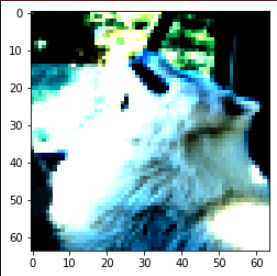
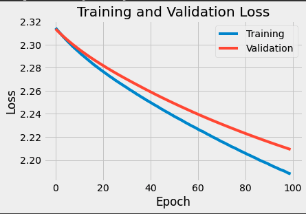

# Jupyter Notebook

Please check out the following Jupyter Notebook that should help you with guidance through the homework:
experiments/deep-learning-experiments.ipynb


# Coding (5 points)

Your task is to implement neural networks and train them to perform classification on different types of data. You will write the following code:

- A function for training a model on a training dataset for one epoch (in `src/run_model.py`)
- A function for evaluating a trained model on a validation/testing dataset (in `src/run_model.py`)
- A function which trains (over multiple epoch), validates, or tests a model as specified (in `src/run_model.py`)
- Two fully connected neural networks (in `src/models.py`)

You will also have to write code for experiments. Note that the free response questions provide necessary information for writing the code above. Therefore, we recommend you write the code after going through the free response questions and follow the same order in running the experiments. 

Your grade for this section is defined by the autograder. If it says you got an 80/100, you get 4 points here.

You should make a conda environment for this homework just like you did for previous homeworks. We have included a requirements.txt.

# <<< Important Notes for my Experiments >>>

- For the free response questions, I did all my development & experimentation in [experiments/deep-learning-experiments.ipynb](https://github.com/NUCS349/fall2020-hw7-neural-networks-kristiyan-dimitrov/blob/master/experiments/deep-learning-experiments.ipynb)
- However, training for 100 epochs on my laptop (CPU, no GPU) took very long. That's why I used Google Colab, which provides free GPUs
- I made my time measurements and training for the MNIST dataset in [experiments/colab_mnist.ipynb](https://github.com/NUCS349/fall2020-hw7-neural-networks-kristiyan-dimitrov/blob/master/experiments/colab_mnist.ipynb)
- Similarly, I did my training and measurements for the DogSet in [experiments/colab_dogs.ipynb](https://github.com/NUCS349/fall2020-hw7-neural-networks-kristiyan-dimitrov/blob/master/experiments/colab_dogs.ipynb)
- Basically, once I made sure things would run correctly on my laptop I moved to Colab to train in a reasonable amount of time and perform the necessary measurements
- In both colabs you will see a lot of print messages; I'm sorry about those :) I was making sure the results are there even if my runtime crashed.

# Free-response questions (5 points)

To answer the free-response questions, you will have to write extra code (that is not covered by the test cases). You may include your experiments in new files in the `experiments` directory. See `experiments/example.py` for an example. You can run any experiments you create within this directory with `python -m experiments.<experiment_name>`. For example, `python -m experiments.example` runs the example experiment. You must hand in whatever code you write for experiments by pushing to github (as you did for all previous assignments). 

**NOTE: if we have any doubts about your experiments we reserve the right to check this code to see if your results could have been generated using this code. If we don't believe it, or if there is no code at all, then you may receive a 0 for any free-response answer that would have depended on running code.**


## PyTorch introduction

For this assignment, you will be learning about a popular library for implementing neural networks called PyTorch. It is very popular to train neural networks using a GPU (because they speed up training by a large factor), but for this assignment **you do not need a GPU** as **all of the training will happen on your CPU**. There are other popular libraries for neural networks, such as TensorFlow, but for this assignment you will be using PyTorch.

Here is the official website for PyTorch: [https://pytorch.org/](https://pytorch.org/)

Here is the API documentation: [https://pytorch.org/docs/stable/index.html](https://pytorch.org/docs/stable/index.html)

Here is a cheat sheet of commonly used methods: [https://pytorch.org/tutorials/beginner/ptcheat.html](https://pytorch.org/tutorials/beginner/ptcheat.html)

Here is a comparison of PyTorch and Numpy methods: [https://github.com/wkentaro/pytorch-for-numpy-users](https://github.com/wkentaro/pytorch-for-numpy-users)

To install PyTorch, find the correct install command for your operating system and version of python [here](https://pytorch.org/get-started/locally/). For "PyTorch Build" select the `Stable (1.7)` build, select your operating system, for "Package" select `pip` , for "Language" select your python version (either python 3.5, 3.6, or 3.7), and finally for "CUDA" select `None`. **Make sure to run the command with your conda environment activated.**

_Note: To determine which python you are using, type `python --version` into your command line._


## Understanding PyTorch 

Read the first four tutorials on [this page](https://pytorch.org/tutorials/beginner/deep_learning_60min_blitz.html) ("*What is PyTorch?*", "*Autograd: Automatic Differentiation*", "*Neural Networks*", and "*Training a Classifier*"). 

## Training on MNIST (1 point)

Let us train neural networks to classify handwritten digits from the MNIST dataset and analyze the accuracy and training time of these neural networks. 

**Build the model architecture:** Create a neural network with two fully connected (aka, dense) hidden layers of size 128, and 64, respectively. Your network should have a total of four layers: an input layer that takes in examples, two hidden layers, and an output layer that outputs a predicted class (10 possible classes, one for each digit class in MNIST). Your hidden layers should have a ReLU activation function.  Your last (output) layer should be a linear layer with one node per class (in this case 10), and the predicted label is the node that has the max value. *Hint: In PyTorch the fully connected layers are called `torch.nn.Linear()`.

**Use these training parameters:** When you train a model, train for 100 epochs with batch size of 10 and use cross entropy loss. In PyTorch's `CrossEntropyLoss` class, the [softmax operation is built in](https://pytorch.org/docs/stable/nn.html?highlight=crossentropyloss#torch.nn.CrossEntropyLoss), therefore you do not need to add a softmax function to the output layer of the network. Use the SGD optimizer with a learning rate of 0.01. 

**Making training sets:** Create training datasets of each of these sizes {500, 1000, 1500, 2000} from MNIST. Note that you should be selecting examples in such a way that you minimize bias, i.e., make sure all ten digits are equally represented in each of your training sets. To do this, you can use `load_mnist_data` function in `load_data.py` where you can adjust the number of examples per digit and the amount of training / testing data. 

*Hint: To read your MNIST dataset for training, you need to use a PyTorch `DataLoader`. To do so, you should use a custom PyTorch `Dataset` class. We included the class definition for you in the HW (`MyDataset` in `data/my_dataset.py`) You can see more details about using custom dataset in this [blog](https://stanford.edu/~shervine/blog/pytorch-how-to-generate-data-parallel) or [github repo](https://github.com/utkuozbulak/pytorch-custom-dataset-examples)). When creating a `DataLoader` set  the `shuffle` property to `True`. 

**Train one model per training set:** Train a new model for each MNIST training set you created and test it on a subset of the MNIST testing set (1000 samples). Use the same architecture for every model. For each model you train, record the loss function value every epoch. Record the time required to train for 100 epochs. From python's built in `time` module, use `time.time()`.

1. (0.25 points) Given the data from your 4 trained models, create a graph that shows the amount of training time along the y-axis and number of training examples along the x-axis.


All of my results in this homework are using GPU: 
name: Tesla T4, 
driver_version: 418.67, 
memory.total [MiB]: 15079 MiB

I was, however, curious to see how the TPU in Colab performs and was surprised to see it actually does _worse_ than the GPU. I suspect its better for more complicated architectures or much larger datasets.


2. (0.25 points) What happens to your training time as the number of training examples increases? Roughly how many hours would you expect it to take to train on the full MNIST training set using the same architecture on the same hardware you used to create the graph in question 1?

From my graph, it's very clear that there is a roughly linear relationship between training size and training time.  
Assuming that linear relationship holds, since it takes ~80 seconds for 1,000 samples, then the full 60,000 training samples in MNIST  
will probably take 80 \* 60 = 4,800 seconds, which is 1 hours, 20 minutes.  

I have to say, I'm very happy I tried using Colab and the GPU. It was ~30 times faster i.e. in the time it took the GPU to go through all 100 epochs, my laptop would go through just 3-4.  

3. (0.25 points) Create a graph that shows classification accuracy on your testing set on the y-axis and number of training 
examples on the x-axis.


4. (0.25 points) What happens to the accuracy as the number of training examples increases?

As expected, the accuracy increases as we increase the size of the training set.


## Exploring DogSet (.5 points)

DogSet is a subset from a popular machine learning dataset called ImageNet (more info [here](http://www.image-net.org/) and [here](https://en.wikipedia.org/wiki/ImageNet)) which is used for image classification. The DogSet dataset is available [here](https://drive.google.com/open?id=1sKqMO7FwT_DyxQJh1YaMKAI6-lrlMXs0). (Note: you need to be signed into your `@u.northwestern.edu` google account to view this link). As its name implies, the entire dataset is comprised of images of dogs and labels indicating what dog breed is in the image. The metadata, which correlates any particular image with its label and partition, is provided in a file called `dogs.csv`. We have provided a general data loader for you (in `data/dogs.py`), but you may need to adopt it to your needs when using PyTorch. **Note: You need to use the dataset class we provided in MNIST questions to be able to use a PyTorch `DataLoader`**

**Validation sets:** Thus far, you have only used "train" and "test" sets. But it is common to use a third partition called a "validation" set. The validation set is used during training to determine how well a model generalizes to unseen data. The model does *not* train on examples in the validation set, but periodically predicts values in the validation set while training on the training set. Diminishing performance on the validation set is used as an early stopping criterion for the training stage. Only after training has stopped is the testing set used. Here's what this looks like in the context of neural networks: for each epoch a model trains on every example in the training partition, when the epoch is finished the model makes predictions for all of the examples in the validation set and a loss is computed. If the difference between the calculated loss for this iteration and the previous is below some _epsilon_ for _N_ number of epochs in a row, then training stops and we move onto the testing phase.  

5. (0.25 points) In Dogset, how many are in the `train` partition, the `valid` partition and the `test` partition? What is the color palette of the images (greyscale, black & white, RBG)? How many dog breeds are there? 

- There are 7,665 observations in the `train` partition
- There are 2,000 observations in the `valid` partition
- There are 500 observations in the `test` partition

- The images are RBG, because they have 3 channels. I found this out by looking at the shape of the datasets.  For example, the shape of the train partition is (7665, 64, 64, 3). This means 7,665 observations, 64x64 pixels for each of the 3 channels.  
- There are 10 dog breeds. I used this code to find out: 
`np.unique(train_dogs_targets, return_counts=True)`

6. (0.25 points) Select one type of breed. Look through variants of images of this dog breed. Show 3 different images of the same breed that you think are particularly challenging for a classifier to get correct. Explain why you think these three images might be challenging for a classifier. 

  

I think these images might be particularly difficult to train, because:  
- In the first one, most of the features of the dog are hidden (it's head is in the snow). If we were using a convolutinal NN, it would find it difficult to classify the dog, because it can't see distinctive features like it's mouth or eyes. Moreover, the presence of snow might fool the network if it mistakes the snow for white fur.
- In the second image, the dog is shown from the side, which might also confuse the network
- The third image has a person in it, which might further confuse the network (maybe it will mistake the person for another breed of dog).

## Training a model on DogSet (2 points)

**Build the model architecture:** Create a neural network with two fully connected (aka, dense) hidden layers of size 128, and 64, respectively. Note that you should be flattening your _NxNxC_ image to 1D for your input layer (where _N_ is the height/width, and _C_ is the number of color channels). Your network should have a total of four layers: an input layer that takes in examples, two hidden layers, and an output layer that outputs a predicted class (one node for each dog class in DogSet). Your hidden layers should have a ReLU activation function. Your last (output) layer should be a linear layer with one node per class, and the predicted label is the node that has the max value.

**Use these training parameters:** Use a batch size of 10 and the cross entropy loss. Use the SGD optimizer with a learning rate of 1e-5. 

**When to stop training:** Stop training after 100 epochs or when the validation loss decreases by less than 1e-4, whichever happens first. 

**Training, Testing, Validation sets:** You should use training examples from `train` partition of DogSet. Validation should come from the `valid` partition and testing examples should come from the `test` partition.

7. (0.5 points) How many connections (weights) does this network have?

```
n_first_layer = 64 * 64 * 3 * 128 # 64*64*3 are the number of inputs from a single image and 128 is the size of the first hidden layer
n_second_layer = 128 * 64 # each node in first hidden layer is connected to each node in second hidden layer
n_third_layer = 64 * 10 # second hidden layer nodes connected to each output node (10 such, 1 for each breed)
print("TOTAL NUMBER OF WEIGHTS = ", n_first_layer+n_second_layer+n_third_layer )
```
TOTAL NUMBER OF WEIGHTS =  1,581,696


8. (1.0 point) Train a model on DogSet. After every epoch, record four things: the loss of your model on the training set, the loss of your model on the validation set, and the accuracy of your model on the training and validation sets. 

    * Report the number of epochs your model trained, before terminating.
      I trained my model with 3 different learning rates: 1e-5, 2 \* 1e-5, 10 \* 1e-5. 
      For the first two, my model trained for the full 100 epochs;  
      The third learning rate made the model stop training after 57 epochs.
  
    * Make a graph that has both training and validation loss on the y-axis and epoch on the x-axis.
  
    I made 3 graphs, one for each of the three learning rates I used: 1e-5, 2 \* 1e-5, 10 \* 1e-5
    
    LEARNING RATE = 1e-5
    
    
    LEARNING RATE = 2 \* 1e-5
    
    
    LEARNING RATE = 10 \* 1e-5
    
  
    * Make a graph that has both training and validation accuracy on the y-axis and epoch on the x-axis. 

    LEARNING RATE = 1e-5. 
    
    
    
    LEARNING RATE = 2 \* 1e-5
    
    
    LEARNING RATE = 10 \* 1e-5
    

    * Report the accuracy of your model on the testing set.

    LEARNING RATE = 1e-5
    Test Accuracy = 20.72%
    
    LEARNING RATE = 2 \* 1e-5
    Test Accuracy = 21.62%
    
    LEARNING RATE = 10 \* 1e-5
    Test Accuracy = 23.78%


9. (0.5 points) Describe the interaction between training loss, validation loss and validation accuracy. When do you think your network stopped learning something meaningful to the problem? Why do you think that? Back up your answer by referring to your graphs.

- First of all, it's natural to see that training loss is lower than validation loss; Similarly, it's normal to see that training accuracy is higher than validation accuracy. Moreover, it's normal for training loss to go down and training accuracy to go up as we train the model for more epochs. Of course, the same is not true for the validation metrics, because at some point the model will begin overfitting the data.  
- Looking at the last graph (with the highest learning rate), it looks like the network stopped learning anything useful after the 45th epoch. I'm basing this on the red curve for validation accuracy. In fact, the accuracy doesn't really improve significantly after the 15th epoch (it goes from 22% to 25% from 15th to 57th epoch).

## Thinking about deep models (1.5 points)

15. (0.25 points) For any binary function of binary inputs, is it possible to construct some deep network built using only perceptron activation functions that can calculate this function correctly? If so, how would you do it? If not, why not?

In lecture slides Z we discussed how  we can use a single Perceptron to represent the logical operators AND, OR, NOT; We also said that a single Perceptron is not enough to represent the XOR operator, but using 3 perceptrons would achieve that. I think these logical operators precisely represent the binary function with binary inputs that we are talking about here. Therefore, the answer is yes, we can calculate any such function correctly by using one or multiple Perceptrons.

17. (0.25 points) Is it possible to learn any arbitrary binary function from data using a network build only using linear activation functions? If so, how would you do it? If not, why not? 

I think the answer is no. I am imagining 4 points in a unit square like this:  
X .... O  
..........  
O .... X  
In this situation, it will be impossible to learn the decision boundary between the 2 classes with only a linear function i.e. the two classes are not linearly separable.

18. (1 point) An adversarial example is an example that is designed to cause your machine learning model to fail. Gradient descent ML methods (like deep networks) update their weights by descending the gradient on the loss function L(X,Y,W) with respect to W. Here, X is a training example, Y is the true label and W are the weights. Explain how you could create an adversarial example by using the gradient with respect to X instead of W.

I couldn't figure this out by myself so I did a little Googling. I ended up reading most of [Explaining and Harnessing Adversarial Examples](https://arxiv.org/pdf/1412.6572.pdf) by Goodfellow et. al. as well as the [Adversarial Examples](https://christophm.github.io/interpretable-ml-book/adversarial.html) chapter in Christoph Molnar's book.

The method they present is called the Fast Gradient Sign Method. 

  

where x is the original vector, x' is the adversarial example and the other term is the gradient of the model's loss function w.r.t. the original input pixel vector x. We are only interested in the sign of each derivative in the Jacobian and are multiplying by a small constant ε, which the original paper describes as "small enough to be discarded by the sensor or data storage apparatus associated with our problem."  

Overall, these adversarial examples are exploting the linear nature of neural networks. I'm a bit fuzzy on the exact math :)


