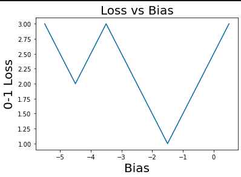

# Free-response questions (5 points)

## 1. (1.25 points) Visualizing Gradient Descent

a. (0.5 points) Setup an experiment to classify the `mnist-binary` dataset (see `load_data.py` for more on that dataset) using the gradient descent learner. Use `fraction=1` when calling `load_data`. For your loss function, use `hinge` loss and set the learning rate (i.e., lambda) to `1e-4`. Keep all other gradient descent parameters as their defaults. After each training iteration through the dataset (using batch gradient descent on just the training data), compute both the loss and accuracy of the model on the full training dataset. Terminate after convergence or after 1000 iterations (i.e., `max_iter = 1000`). Construct and include two (labeled) plots of the loss and accuracy at each iteration. Note that when `batch_size` is not set, it trains on all available training data for each step.

	

I reached convergence after a little less than 700 iterations.

b. (0.5 points) Repeat the previous experiment, but this time using stochastic gradient descent (i.e., we accomplish this by changing `batch_size`). Compute and plot the loss and accuracy over the entire dataset after each *epoch*. One epoch is one iteration through the entire dataset. Note that you will need to increase the value of `max_iter` to do this. For example, if we have 500 examples, setting `max_iter=500` and `batch_size=1` would result in one epoch of stochastic gradient descent. Terminate after convergence or after 1000 epochs. Construct and include the two (labeled) plots of the loss and accuracy at each epoch.

Below are the results after 1000 epochs.
Here, I set the max iterations to 1000 * len(train_mnist) = 1000 * 1000 i.e. 1000 epochs of going through all of the data.

	

To understand what's happening better, I graphed the first 15000 iterations (i.e. first 15 epochs)
	

c. (0.25 points) Compare the plots generated from batch gradient descent and stochastic gradient descent. Which one seems to be faster to train? Which one converges to a lower average loss on the training data? Are there differences in the behavior of the loss and accuracy throughout training?

Stochastic Gradient Descent appears to converge faster (if we compare epochs in 1b to iterations in 1a). It also appears to be reaching a lower loss on the training data. It is important to note, however, that I had to remove the early convergence criteria, because the model was converging very quickly and I couldn't make meaningful graphs. As a result, the model from 1b has trained on much more data (because of the large number of epochs and iterations, whereas the model in 1a trained for only ~700 iterations. That's why the loss in 1b might be much lower).

## 2. (1.25 points) Loss Landscapes and the Effects of Batching
a. (0.5 points) Here we will setup an experiment that will allow us to visualize the loss landscape of the `synthetic` dataset (see `load_data.py` for more on that dataset). Here, we define the "loss landscape" as the loss at every value value of the model parameters with respect to our input data. For more information about loss landscapes see the lectures slides for gradient descent. For this experiment, we will be looking at the loss landscape of a model with only bias terms, meaning all other parameters have values of exactly 1. Note that this model does not do any "learning" because we are setting the weights explicitly (this means you will not be using your `fit()` function). In your experiment, first load the `synthetic` dataset (with `fraction=1`). Using only the bias term, determine the 0-1 loss over the entire dataset by explicitly setting your bias values to 0.5, -0.5, -1.5, -2.5, -3.5, -4.5, and -5.5. Construct a plot of the loss landscape by plotting the bias on the X axis and the loss on the Y axis. Include your (labeled) plot and describe the minima of the loss landscape.

Below is the 0-1 Loss w.r.t. the different values for bias. Since the 0-1 loss function is supposed to be a step function, the right graph shows the "real" loss landscape

 

b. (0.5 points) Now we will examine how the loss landscape changes when you select data differently. By analyzing the `synthetic` dataset and the loss landscape plot you have generated, select a set of 4 points from the dataset that, if you optimize considering only that set, cause the global minimum of the loss landscape to shift. Repeat your experiment from part (a) on this set of 4 points, plot the resulting loss landscape and compare it to the loss landscape from part (a).

I removed the 3rd & 4th points from the data.

features
[0,1,2,3,4,5] ==> [0,1,4,5]  
targets  
[-1,-1,1,1,-1,1] ==> [-1,-1,-1,1]

 

c. (0.25 points) Based on your answers from part (a) and (b), explain what effect batching can have on the loss landscape and the convergence of gradient descent.

When we train on a batch i.e. a subset of the training data, we have "incomplete" information. This means that the loss landscape looks like it has a minimum at a given value and Gradient Descent will modify model parameters to get closer to that minimum. However, this is not the "real" loss landscape so we won't really be going towards the optimal value.  
Overall, the effect is that we won't be decreasing the training loss as quickly as with batch gradient descent, because we won't be going exactly in the direction of greatest slope. There are at least 2 benefits of batching: faster training and allows us to overcome difficulties when the available data doesn't all fit in memory.

## 3. (1 point) Multiclass Classification with Gradient Descent
a. (0.5 points) Setup an experiment to classify the `mnist-multiclass` dataset using the One-vs-All gradient descent learner (see `load_data.py` for more on that dataset). Use `fraction=0.75` when calling `load_data`. Use `squared` loss and `l1` regularization with the default learning rate and regularization parameters. Train your learner on the training partition (report what values you used for `batch_size` and `max_iter`), and run prediction on the testing partition. Generate the confusion matrix of the testing partition (using the `confusion_matrix` function in `metrics.py`) and include the confusion matrix as a table. Label the rows with the ground truth class and the columns with the predicted class. Describe the most common misclassifications made by your system. Which numbers appear to be most difficult to distinguish from one another? Which appear to be easiest to distinguish?

I used batch_size=None i.e. the default, which does batch gradient descent i.e. takes the entire training data. I used max_iter = 1000, but due to early convergence criteria, most of the one-vs-all gradient descent binary classifiers trained with 100-200 iterations.

   PREDICTED CLASS
|   | 0  | 1  | 2  | 3  | 4  |
|---|----|----|----|----|----|
| 0 | 24 | 0  | 1  | 0  | 0  |
| 1 | 0  | 24 | 0  | 1  | 0  |
| 2 | 0  | 3  | 19 | 1  | 2  |
| 3 | 2  | 1  | 0  | 21 | 1  |
| 4 | 1  | 0  | 1  | 0  | 23 |

(Actual Class along vertical)

The number 0 and 1 appear to be easiest to distingush (both have precision of 100%).  
On the other hand, the classfier appear to be mistaking some "2" for "1" the most (It predicted a "1" for an actual "2" a total of three times).


b. (0.25 points) In this assignment, we used One-vs-All (OVA) with linear decision boundaries to handle multiclass classification. For a dataset with _c_ classes and _d_ features, how many linear binary classifiers are needed in OVA classification? What is the space complexity of the OVA model (i.e., the set of learned decision boundaries)?

- If we have C number of classes, then we need C number of binary classifiers - one classifier for each class to distinguish observations in that class from observations in all other classes.
- A linear boundary in D-dimensional space requires D number of parameters. E.g. a line in 2-dimensional space is defined by 2 parameters a & b where y = a+bx. Thereforem if we have C number of classes with one decision boundary each, the space complexity will be O(C\*D)

c. (0.25 points) An alternative to OVA classification is One-vs-One (OVO) classification, in which a binary classifier is trained to discriminate between each pair of classes, and the final prediction is decided via majority vote. For the same dataset considered in part (b), how many binary classifiers are need in OVO classification? What is the space complexity of our OVO model?

- We would need C \* (C-1) / 2 binary classifiers
- By similar reasoning to part b), our space complexity will be O(C<sup>2</sup> \*D)

## 4. (1.5 points) Regularization and Feature Selection
a. (0.5 points) Here we will explore the use of regularization as a means of feature selection. Setup an experiment using the `mnist-binary` dataset. Use `fraction=1` when calling `load_data`. Run gradient descent on the `mnist-binary` training dataset using squared loss, using both `l1` and `l2` regularization. Set the step size, or `learning_rate`, to `1e-5` and the maximum number of iterations to `2000`. Report your values for how many digits from each class you used, what your batch size was, and how many iterations you used. For each regularizer, run the algorithm  once for each of the following values for lambda: [1e-3, 1e-2, 1e-1, 1, 10, 100]. Plot the number of non-zero model weights from the learned model for each value of lambda. (Here we define non-zero values as values whose absolute value is greater than some `epsilon`, where `epsilon = 0.001`.) Plot both regularizers on one plot. Include your (labeled) plot and describe the trend in non-zero parameters for each regularizer.

Number of non-zero parameters (less than epsilon=1e-3) for L2 Regularization is: [368, 386, 387, 297, 7, 1]. 
Number of non-zero parameters (less than epsilon=1e-3) for L1 Regularization is: [391, 389, 373, 318, 0, 0].


Both regularizers show us that as we increase the strength of the regularization i.e. increase lambda, the more our model parameters shrink.

b. (0.5 points) Compared to the L2 regularizer, what property of the L1 regularizer allows it to promote sparsity in the model parameters? Describe a situation in which this sparsity is useful.

Using L1 is sometimes preferential if we don't have many observations in our data and we want to keep only those features, which are most significant for amking predictions. L2 regularization simply shrinks the size of the model parameters, but doesn't necessarily set them to 0, while L1 regularization does set unimportant features to 0.

c. (0.5 points) Using L1 regularization with `reg_param=1`, make a 2D heatmap that shows which weights in a trained model have non-zero values (as defined in problem 4a). Your heatmap should only have two colors--one color for non-zero values and another color for zero values. Make sure to clearly label which color corresponds to zero and non-zero values. This heatmap should have the same shape as your input images. Is there any discernible pattern as to which values are zero? 

Unfortunately, I don't see any discernible pattern in the below image. I was expecting the corners to be black regions, because most MNIST digits are located in the center of the image and therefore the corners are not relevant features.

White = 1; Black = 0


For reference, this is the code I used to generate the above:
```python
epsilon = .001
loss_func = 'squared'
reg = 'l1'
lr = 1e-5

gd_l1 = GradientDescent(loss=loss_func, regularization=reg, learning_rate=lr, reg_param=1)
gd_l1.fit(train_features, train_targets, max_iter=2000)

values = gd_l1.model[:-1] # Removing the bias term so the values are 28x28
non_zero_values = np.where(values < epsilon, 0, 1)
square_values = non_zero_values.reshape((28,28))

plt.figure(figsize=(20,10))
plt.imshow(square_values, cmap='hot')
plt.show()
```
