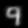
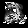

## Free-response questions (2 points, 1 point per question)

1. What happens as Beta in soft k-Means approaches infinity? How does this relate to regular K-Means?
	
	- As beta approaches infinity, soft k-Means gets closer and closer to "hard" i.e. regular K-Means.
	Essencially, means further away from a given point have less and less "influence" on the point, until ultimately when beta -> infinity, only the closest mean influences the assignment of a given point.

2. Draw a data distribution using [ml-playground](http://ml-playground.com/) that would be better modeled using a GMM x than with soft k-Means. Explain why this is so. Include the plot you made in ML playground. (Hint: Think about the Covariance Matrix)

	There are two issues with k-means
	- It assumes clusters of roughly equal sizes
	- It assumes "spherical" clusters i.e. it doesn't allow for any covariance between feature dimensions 

	While soft k-means somewhat alleviates the first issue i.e. can have clusters of unequal sizes, it still doesn't work well for non-spherical clusters like the ones shown below.
	The first image is the "true" distribution, the second is how I think soft k-means would assign labels.

	
	

## Clustering handwritten digits (3 points total, breakdown shown below)

In this problem, we will attempt to cluster handwritten digits contained in the MNIST dataset.
Because we do not use the labels themselves during training of k-Means or GMMs (i.e., we are performing _unsupervised_ learning), we can measure our performance directly on the dataset we used to train. For that reason, we will work only with the test partition of the MNIST dataset on this portion of the assignment.

Download the test partition of the MNIST dataset from the following links:

- [images](http://yann.lecun.com/exdb/mnist/t10k-images-idx3-ubyte.gz)
- [labels](http://yann.lecun.com/exdb/mnist/t10k-labels-idx1-ubyte.gz)

Use the data loader found in `src/mnist.py` to load the MNIST test images and labels.

Rather than training on the entire test partition, we will use a _class-balanced_ partition of the test set (i.e., we will use an equal number of examples from each class).
Find the digit that has the fewest examples in the MNIST test dataset. Let the number of examples of this digit in the MNIST test dataset be _n_.
Randomly sample _n_ examples from each digit in the MNIST test dataset without replacement. This will be the subset of examples that we will use in our experiments.

	- The value counts for the digits (found using np.unique(labels, return_counts=True)) are:
			(array([0, 1, 2, 3, 4, 5, 6, 7, 8, 9], dtype=int8),
 			array([ 980, 1135, 1032, 1010,  982,  892,  958, 1028,  974, 1009]))

 	- The digit with the fewest examples is "5" with 892 examples.

Now you will test your clustering algorithms on this class-balanced partition.
Each image in MNIST has dimensionality 28x28. Flatten this representation such that each image is mapped to a 784-dimensional vector (28*28), where each element of the vector is the intensity of the corresponding pixel in the image. Cluster these vectors into 10 clusters (i.e., `n_clusters`=10) using the following algorithms:
- k-Means
- Gaussian Mixture Model

NOTE: IF YOUR IMPLEMENTATION OF GMM/K-MEANS IS TOO SLOW FOR THESE EXPERIMENTS (OR YOUR IMPLEMENTATION 
DOESN'T WORK), YOU MAY USE THE IMPLEMENTATION CONTAINED IN SCIKIT-LEARN TO SOLVE THE FREE-RESPONSE QUESTIONS: 

https://scikit-learn.org/stable/modules/generated/sklearn.cluster.KMeans.html
https://scikit-learn.org/stable/modules/generated/sklearn.mixture.GaussianMixture.html

### Comparing approaches without labels (1 point)
Report the performance of each of these algorithms using the Adjusted Mutual Information Score (implemented in `src/metrics.py` for you). Which algorithm performed best?

	- adjusted_mutual_info_score(digits_labels, kmeans_pred) gave me a value of 0.492
	- adjusted_mutual_info_score(digits_labels, gmm_pred)    gave me a value of 0.545
	- The possible values are between 0 and 1, higher values are better
	- Therefore, GaussianMixtures appears to be performing better!

### Comparing approaches with labels (1 point)
Since we actually _do_ know the labels of the handwritten digits, we can also consider the accuracy of these unsupervised approaches.
For each cluster, find the most common label of all examples in that cluster. Call that the label of the cluster.
Find the proportion of images whose label matches their cluster label. That's the accuracy.
Report the performance of each of these algorithms using this measure. Which algorithm performed best? Is this the same one that did best with Adjusted Mutual Information Score?

KMeans Performance 

| Cluster Label | # w/ Cluster Label | Total # Observations | % Accuracy |
|:-------------:|:------------------:|:--------------------:|:----------:|
|       2       |         612        |          701         |    87.3    |
|       3       |         625        |         1199         |    52.1    |
|       8       |         519        |         1082         |    47.9    |
|       9       |         461        |         1189         |    38.7    |
|       4       |         262        |          645         |    40.6    |
|       1       |         506        |          664         |    76.2    |
|       0       |         727        |          785         |    92.6    |
|       7       |         493        |         1075         |    45.8    |
|       6       |         623        |          708         |    87.9    |
|       1       |         380        |          872         |    43.5    |

- It's important to note that 5 is not the majority label in any cluster! Inspecting the data I see that the last cluster, the second one labelled "1" actually has the second most common label "5"

	GMM Performance

	| Cluster Label | # w/ Cluster Label | Total # Observations | % Accuracy |
	|:-------------:|:------------------:|:--------------------:|:----------:|
	|       2       |         634        |          716         |    88.5    |
	|       1       |         783        |         1052         |    74.4    |
	|       0       |         359        |          437         |    82.1    |
	|       7       |         645        |          722         |    89.3    |
	|       3       |         478        |          861         |    55.5    |
	|       8       |         672        |         1811         |    37.1    |
	|       9       |         520        |         1191         |    43.6    |
	|       0       |         453        |          535         |    84.6    |
	|       4       |         300        |          785         |    38.2    |
	|       6       |         738        |          810         |    91.1    |

	- Similarly to KMeans the "5" label is missing! Looking at the data more carefully I saw that a lot of 5's were in the cluster where the cluster label (i.e. majority label) is 8.

	- As an overall measure of accuracy I calculated weighted accuracy (where the weights are the number of observations in a given cluster). Essentially, this is the sum of the 2nd column divided by the sum in the third column. The answer for KMeans is 58.38% and for GMM it is 62.57%. I think this is a rough estimate of "cluster homogeneity" and once again it appears that GMM is performing slightly better!

### Visualization (1 point)
Visualizing examples within each cluster can help us understand what our clustering algorithms have learned. Here are two ways that a cluster can be visualized:

1. Find the Mean of all examples belonging to a cluster.

	- Since the best performing algorithm is GMM, I will visualize it.
	Below are the cluster means for the clusters with majority labels: [2,1,0,7,3,8,9,0,4,6] i.e. in the same order as the table above  
	
	
	
	
	
	
	
	
	
	

2. Find the Mean of all examples belonging to a cluster, then find the nearest example to the Mean (i.e., the nearest neighbor).

	
	
	
	
	
	
	
	
	
	

For the best performing algorithm according to Adjusted Mutual Information Score, perform both of these visualization techniques on all 10 clusters. Show us the results of the visualization.
Note that you will have to reshape your features to 28x28 images to see the results. Use Euclidean distance to determine the nearest neighbor.

What visual differences do you notice between the images generated from each of the visualization techniques? What artifacts do you notice with the first technique? What do you think is the causing these artifacts?

	- An artifact in the means is that they are "fuzzy". This is due to the fact that they are means.
	- Another interesting artifact is that the 6th mean looks like an 8, but its closest neighbour is a 3
	- In the same way, the second last mean looks like a 9, but the closest neighbour is a 4
	- These visualizations give us an idea of what kind of "mistakes" our clustering algorithm might be making.

### Generating handwritten digits (1 point - bonus)
This section is optional but can be completed for an extra point on this assignment.

To answer this question, you can use the scikit-learn implementation of the Gaussian Mixture Model:

https://scikit-learn.org/stable/modules/generated/sklearn.mixture.GaussianMixture.html

A Gaussian Mixture Model is a *generative* model, meaning that it can not only cluster points but can also generate new points.
Pick a digit class from the testing set of MNIST (e.g., 5) and fit a Gaussian Mixture Model to all examples from that class. Train 4 GMMs with the following values of `n_components`: 1, 4, 10, and 20 (Note: A component is another term for a cluster).
For each trained GMM, sample 5 images using the `GMM.sample` function and show them to us. How does the number of components affect the quality of the sampled images?

I chose to work with all the "2" in the data. There are 1,032 of them.

n_components = 1

n_components = 4

n_components = 10

n_components = 20

n_components = 50

I added n_components = 50 as well. From the looks of it, a higher number of components leads to clearer samples i.e. samples that more closely resemble the number 2.

