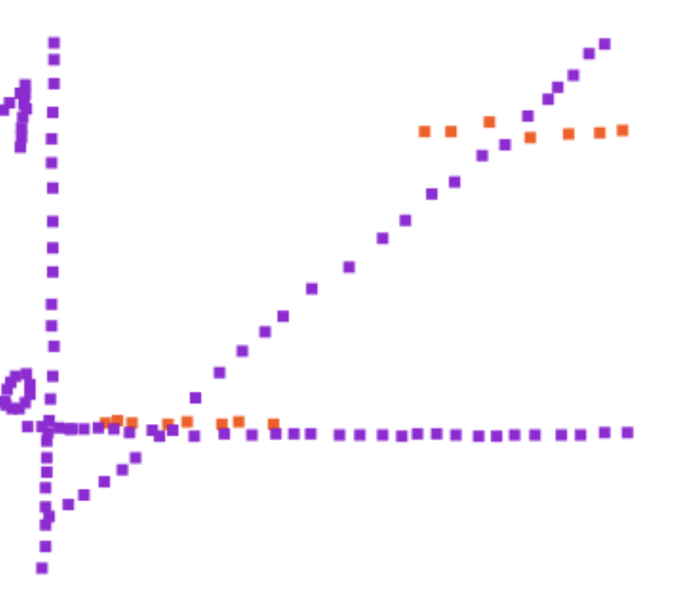

## Problems

## Code implementation (6 points)
Pass test cases by implementing the functions in the `src` directory.

Your grade for this section is defined by the autograder. If it says you got an 80/100,
you get 4.8 points here.

## Free response questions (4 points)

Answer the following free response questions in a separate document, 
saved as a .pdf and **uploaded to Canvas**.

#### 1. (1.5 points total) Use the function you implemented `generate_regression_data` to generate 100 points of data (`amount_of_noise` = 0.1) from a polynomial function of degree 4. Randomly select 10 points as your training data. The rest will be your testing data.  Run your implementation of `PolynomialRegression` 10 times, starting with degree 0 and increasing the degree of the polynomial each time, until you reach degree 9. Now create the following graphs.
   - A. (0.75 points) A graph that shows the error of your regression on the data as a function of degree. Make the horizontal dimension be degree of the polynomial used to fit the data. Make the vertical dimension the error. Label your axes. Put two lines on this plot, one that shows TRAINING error as a function of polynomial degree, and one that shows TESTING error as a function of polynomial degree. Make sure to label which is testing and which is training error.
 *Hint:  Sometimes you don't see the error for some polynomial degree because another one has huge error, making the scale too large to see the error for the other (also bad) polynomial. If you might have this situation, try taking the log of the error before plotting it.* 

 

The lowest log Test MSE is -.78 for polynomial of degree 4;  
The lowest log Train MSE is -4.72 for polynomial of degree 9.

   - B. (0.75 points) Create a 2nd plot that shows a scatterplot of your training data. Overlay this scatterplot with plots of the following polynomial curves.
      - The polynomial with lowest testing error ( Be sure to label this curve with its degree and "lowest testing error". )
      - The polynomial with lowest training error ( Be sure to label this curve with its degree and "lowest training error". )

The lowest log Test MSE is -.78 for polynomial of degree 4;  
The lowest log Train MSE is -4.72 for polynomial of degree 9.
     
#### 2. (0.5 points)  Given your plots from question 1, describe the relationship between the degree of the polynomial used to fit the data and the training/testing error. At what degree of polynomial do you think you started overfitting the data? 

From the first graph, it's clear that both Training and Testing MSE decrease as we increase the degree of the polynomial until we reach degree=4. After degree 4, we see that the training error continues decreasing, while the testing error starts increasing. Therefore, we've started overfitting the training data after degree=4. This is supported by the second graph as well. We can see that the orange line of the degree 4 polynomial nicely goes through the data without incorporating the noise in the data. The 9th degree polynomial on the other hand goes through most of the points and is clearly overfitting to the noise in the data.

#### 3. (1 point total, 0.5 point each for A and B like in question 1) Repeat everything you did in question 1 with one difference: randomly select 50 points as your training data. 

The lowest log Test MSE is -1.82 for polynomial of degree 4;  
The lowest log Train MSE is -2.17 for polynomial of degree 9.

We can draw pretty much the same conclusions as we did for the previous case with 10 training points.

#### 4. (0.5 points) Compare your results from question 1 and question 3. How did increasing the number of training examples affect things? 

With more training data, the model generalizes a bit better. In other words, the difference between testing error and training error is smaller as we continue to overfit. This can be seen by teh fact that the gap between the orange and blue dots is smaller in the right half of the scatter plot. Similarly, we can see that the orange and blue lines in the second graph are much more closely alligned with each other.

#### 5. (0.5 points) Explain how to do linear classification via linear regression. Be clear. Use a graph to illustrate how it works. This graph doesn't need to be generated by your code, but it must be clearly labeled and made by you (not cut and pasted from somewhere). Explain one key weakness of classification via regression. Be clear. Perhaps illustrate this point, as well, with a graph.

(Please excuse the ugly graph). The orange dots are observations, which are 1-hot encoded as 0 or 1.
The purple dots represent lines (the axis lines and the fitted regression line)

We could fit linear regression to binary data (which has been 1-hot encoded) as usual.  
Then, when we want to predict a class for a new point, we can use our fitted line and check if the predicted probability is more or less than .5. If more, classify as 1, if less, classify as 0.

The problem with this is that this type of model assumes the possibility of negative probability.  This is reflected in the possibility of having values for x which are negative on the y axis.
It also allows for probabilities greater than 1. Neither of these is desirable or realistic.
